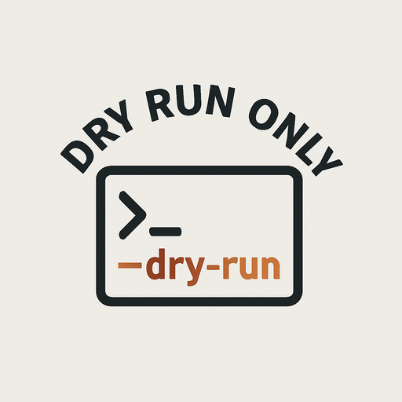

<picture>
  <source media="(prefers-color-scheme: dark)" srcset="dry-run-only-logo-512.png">
  <source media="(prefers-color-scheme: light)" srcset="dry-run-only-logo-512.png">
  
</picture>

# DRY Run Only 🚦
**Because sometimes, pressing the big red button is just… too risky.**

Welcome to **DRY Run Only** — a space for experiments, proof-of-concepts, and ideas that might one day make it to production… or not.  
We test, we tinker, we simulate — but we *never* (okay, *rarely*) go live without a plan.

---

## 🛠 What We’re About
- **Safe Deployments** – Test your pipelines, scripts, and infra changes before they touch prod.
- **Playground Projects** – Sandboxes for learning new tech without consequences.
- **DevOps Humor** – Because a little laughter makes debugging easier.
- **Reusable Tools** – Shareable scripts, configs, and automation patterns.

---

## 📂 Repository Types
| Repo Type       | Purpose |
|-----------------|---------|
| `*-poc`         | Proof of concept codebases. |
| `*-sandbox`     | Experimentation zones. |
| `*-template`    | Ready-to-fork starters for CI/CD, infra, and app builds. |
| `*-utils`       | Scripts, tools, and helpers for everyday DevOps life. |

---

## 🚀 Philosophy
> *“A DRY run is like a rehearsal — mess up here, so you don’t mess up there.”*  

We believe in:
- Testing in isolation before deploying in production.
- Automating rollback paths.
- Documenting *why* something works, not just *how*.

---

## 🤝 Contributing
Pull requests are welcome — just make sure you’ve done a `--dry-run` first.  
We keep things collaborative, fun, and respectful.

---

## 📜 License
This organization’s projects use various open-source licenses. Check individual repos for details.

---

**DRYRunOnly** — *We don’t push to prod without a rehearsal.*
